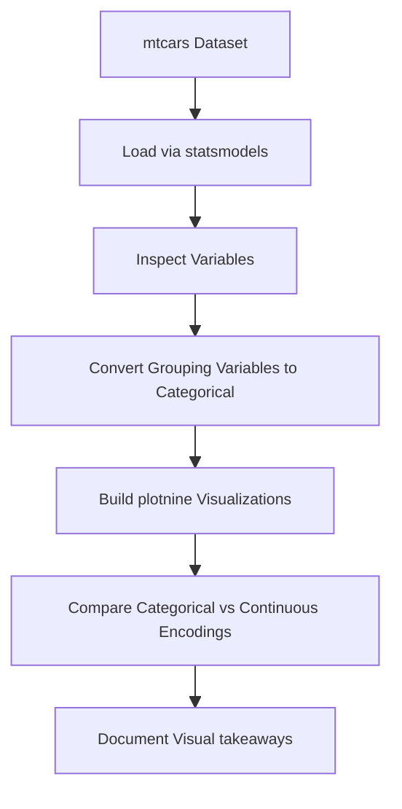
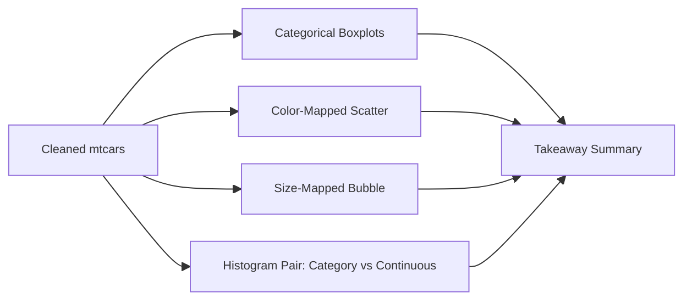
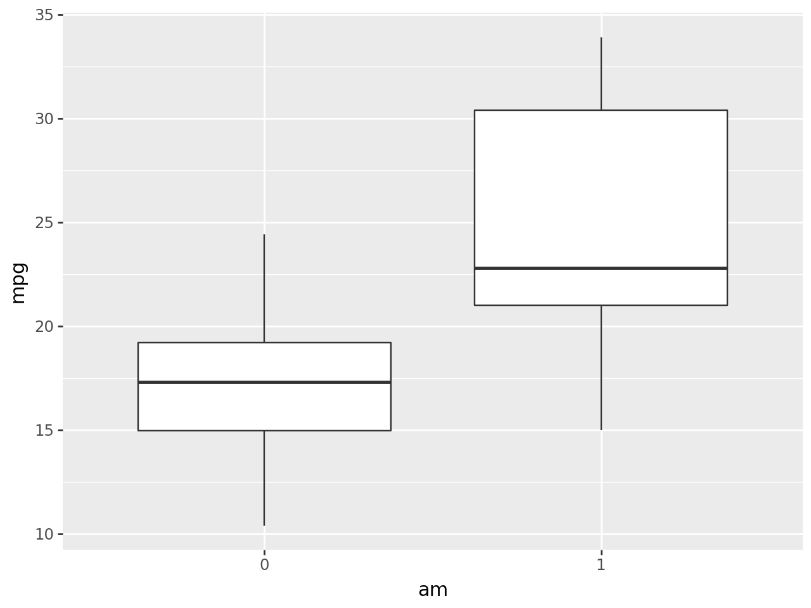
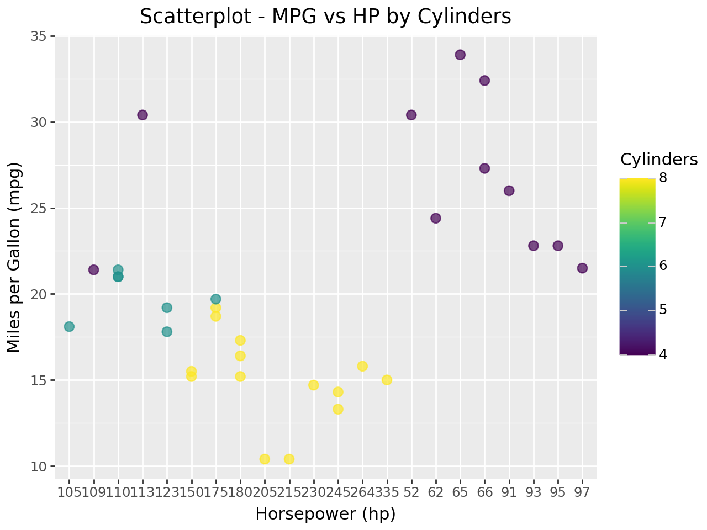
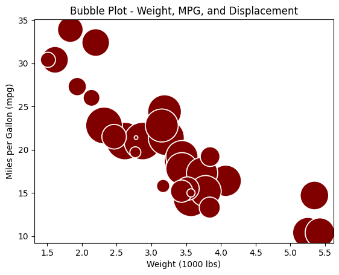
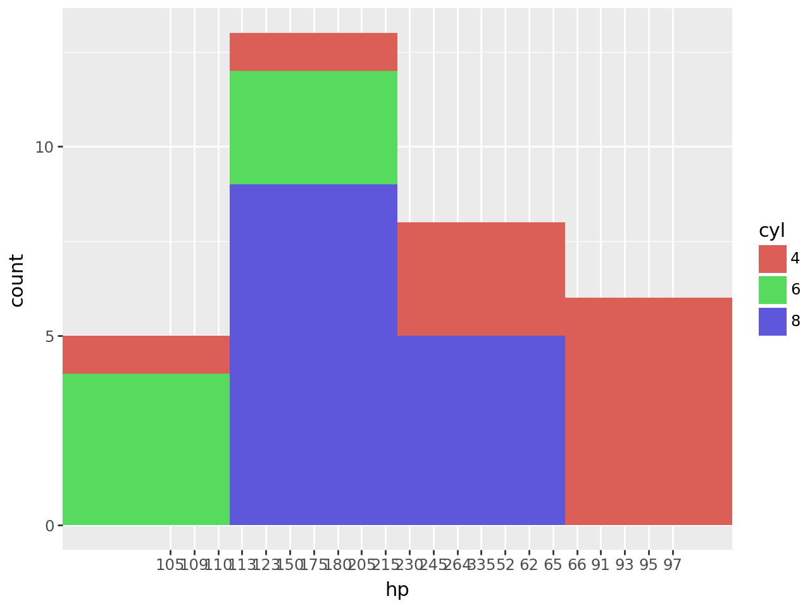
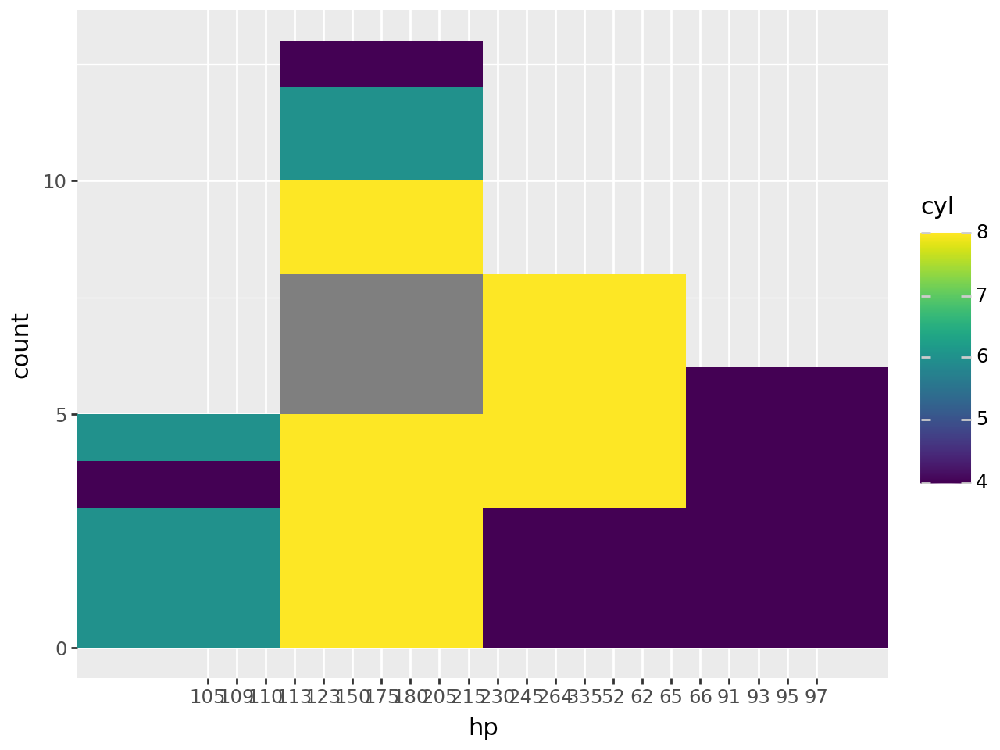

# Cars Exploratory Data Analysis


---

## Overview

This project explores the classic `mtcars` dataset using Python and `plotnine`, a grammar-of-graphics visualization library inspired by `ggplot2`. The notebook focuses on how variable-type choices shape plots and interpretation.

The workflow includes:
- Loading the `mtcars` dataset from `statsmodels`
- Casting numeric grouping variables (`cyl`, `am`, `gear`, `carb`, and others) to string for categorical treatment
- Distribution and relationship visualization with `plotnine`, `matplotlib`, and `seaborn`
- Side-by-side comparison of the same plot under categorical and continuous encodings
- Plain-language insight summaries per visualization

The project demonstrates how exploratory analysis decisions — especially encoding choices — directly drive what a plot communicates.

---

## Project Workflow



---

# Analytical Problem

Exploratory data analysis is the first step in any structured-data project. Plots are only as informative as the encoding decisions behind them, and the same variable can drive very different visualizations depending on whether it is treated as a category or a number.

Effective EDA can support:
- Feature-engineering decisions before modeling
- Communication of findings to non-technical stakeholders
- Discovery of joint relationships between variables
- Detection of distribution irregularities
- Teaching examples for grammar-of-graphics libraries

This project uses the `mtcars` dataset to surface those encoding effects in a small, focused notebook.

---

# Dataset

The notebook loads the `mtcars` dataset from `statsmodels`:

```python
mtcars = sm.datasets.get_rdataset("mtcars", "datasets", cache=True).data
```

The dataset includes fuel efficiency, engine, transmission, and vehicle-design variables such as:

| Variable | Meaning |
| --- | --- |
| `mpg` | Miles per gallon |
| `cyl` | Number of cylinders |
| `hp` | Horsepower |
| `wt` | Weight in thousands of pounds |
| `disp` | Engine displacement |
| `am` | Transmission type |
| `gear` | Number of forward gears |
| `carb` | Number of carburetors |
| `vs` | Engine shape indicator |
| `drat` | Rear axle ratio |
| `qsec` | Quarter-mile time |

### Target of Analysis
- Visual relationships between fuel efficiency, engine specs, and design choices
- The effect of variable-type choice on `plotnine` output

This is an exploratory analysis project, not a modeling project.

---

# Exploratory Data Analysis (EDA)

### Key Findings
- Manual cars (`am = 1`) post a higher median `mpg` and a wider spread than automatics
- Low-cylinder cars cluster in the high-mpg / low-hp region; 8-cylinder cars sit in the high-hp / low-mpg corner
- Heavier cars get fewer miles per gallon, and engine displacement scales with weight — the bubbles drift down-right as size grows
- Encoding `cyl` as a category produces clean grouped plots; encoding the same column as a number forces `plotnine` into a continuous color scale and loses group separation

---

# Data Preprocessing

The preprocessing workflow includes:

- Loading the dataset through `statsmodels`
- Casting grouping columns (`cyl`, `am`, and others) to string or categorical type for grouped plots
- Reusing the same column under both encodings for the comparison plot pair
- No missing-value handling required — `mtcars` is small and clean

### Pipeline Components
- `statsmodels.datasets.get_rdataset` for loading
- `pandas` `.astype(str)` / `.astype(float)` / `.astype("category")` for type casting
- `plotnine` for grammar-of-graphics plotting
- `matplotlib` / `seaborn` for KDE and bubble plots

The preprocessing layer is intentionally light so that variable-type choices become the visible driver of plot differences.

---

# Visualization Approach

The notebook builds four families of visualization on top of the cleaned dataset.



### Plotting Configuration
- Library: `plotnine` (primary), `matplotlib` / `seaborn` (auxiliary)
- Theme: default grid
- Encoding focus: explicit categorical vs continuous behavior
- Goal: make encoding effects visible rather than hidden behind plot aesthetics

---

# Visualizations & Findings

### Fuel Efficiency by Transmission

Casting `am` to a string treats transmission as a category and lets `geom_boxplot` produce a clean two-group comparison. Manual cars (`am = 1`) post a noticeably higher median `mpg` and a wider spread than automatics.



### MPG vs Horsepower, Colored by Cylinder Count

A scatterplot with `cyl` mapped to color makes the joint relationship visible: low-cylinder cars cluster in the high-mpg / low-hp region, while 8-cylinder cars sit in the high-hp / low-mpg region.



### Weight, MPG, and Displacement

A bubble plot encodes a third variable through point size. Heavier cars get fewer miles per gallon, and displacement scales with weight — the bubbles grow as the points drift down-right.



### Why Variable Types Matter

The same histogram code produces very different plots depending on whether `cyl` is stored as a category or a number. As a category, each cylinder count gets its own discrete color and the groups separate cleanly. As a number, `plotnine` reaches for a continuous color scale, which forces the legend into a gradient and reduces interpretability.

| Categorical `cyl` | Continuous `cyl` |
| --- | --- |
|  |  |

### Key Findings
- Treating `cyl`, `am`, `gear`, and `carb` as categorical values makes grouped plots easier to interpret
- The same numeric column produces visibly worse plots when left as a continuous variable in grouped contexts
- Joint relationships (weight + mpg + displacement) compress neatly into a single bubble chart without losing information
- The histogram pair is the clearest single argument for explicit type conversion before plotting

---

# Results Interpretation

The project demonstrates how a small EDA notebook can teach a transferable lesson: encoding choices, not just plot type, drive what a visualization communicates.

Potential applications include:
- Onboarding examples for grammar-of-graphics libraries
- Pre-modeling exploration templates for tabular data
- Teaching material on categorical vs continuous color scales
- Foundation for extending to richer auto-industry datasets
- Style reference for portfolio EDA notebooks

---

# Technologies Used

- Python
- pandas
- statsmodels
- plotnine
- matplotlib
- seaborn
- Jupyter Notebook

---

# Repository Structure

```text
cars-exploratory-data-analysis/
│
├── cars_exploratory_data_analysis.ipynb
├── cars_ exploratory_data_analysis.html
├── images/
│   ├── boxplot-mpg-by-transmission.png
│   ├── scatter-mpg-hp-cyl.png
│   ├── bubble-weight-mpg-disp.png
│   ├── histogram-cyl-categorical.png
│   └── histogram-cyl-continuous.png
└── README.md
```

---

# How to Run

1. Clone the repository
2. Install required dependencies
3. Open `cars_exploratory_data_analysis.ipynb` in Jupyter Notebook or Google Colab
4. Run all notebook cells sequentially

```bash
pip install pandas statsmodels plotnine matplotlib seaborn
```

---

# Future Improvements

- Add a short findings paragraph below each visualization
- Add a cleaned notebook version with only final analysis cells
- Include a small data dictionary for every `mtcars` variable
- Extend the comparison to other grammar-of-graphics libraries (`ggplot2`, `lets-plot`)
- Add interactive `plotly` versions of the strongest plots

---

# Author

**Pranika Chandra**  
Projects focused on exploratory data analysis, grammar-of-graphics visualization, and applied data science.
